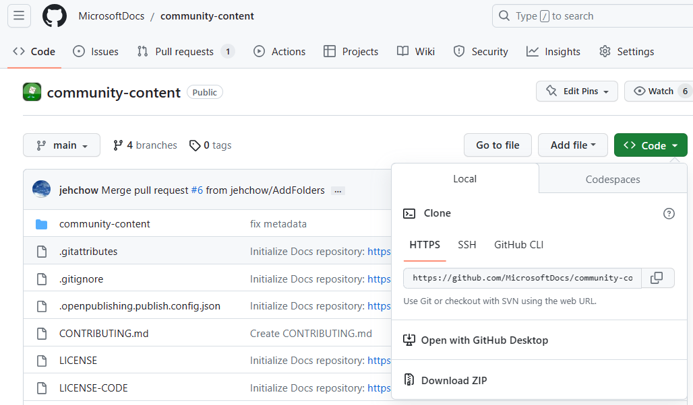
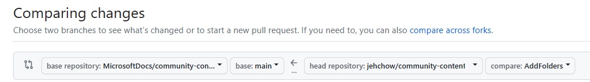

# Contributing

This project welcomes contributions and suggestions. Most contributions require you to
agree to a Contributor License Agreement (CLA) declaring that you have the right to,
and actually do, grant us the rights to use your contribution. For details, visit
https://cla.microsoft.com.

When you submit a pull request, a CLA-bot will automatically determine whether you need
to provide a CLA and decorate the PR appropriately (e.g., label, comment). Simply follow the
instructions provided by the bot. You will only need to do this once across all repositories using our CLA.

This project has adopted the [Microsoft Open Source Code of Conduct](https://opensource.microsoft.com/codeofconduct/).
For more information see the [Code of Conduct FAQ](https://opensource.microsoft.com/codeofconduct/faq/)
or contact [opencode@microsoft.com](mailto:opencode@microsoft.com) with any additional questions or comments.

## Allowed content

* Quality, helpful technical content that adds value. Examples of this: Solving a problem, sharing valuable tips or processes, or reducing time to implement a solution.
* Use your voice and style!
* Occasional quoting or referring to other sources or webpages is allowed, but you must make sure to cite sources.

## Prohibited content

* No marketing or advertising.
* No licensing or pricing information.
* No AI-exclusively generated content; if AI-assisted in writing the content, this must be explicitly mentioned by adding 'AI-contribution' as a value to the 'content_well_notification' metadata attribute. Adding this value will add a disclaimer at the top of the article.
* Harmful content, such as processes that may leave a system or process in a stuck state, or clearly violates laws or terms and conditions.
* Content that doesn't belong to you; plagiarism is strictly prohibited.
* Low-effort articles, such as having a single link to another site; a single video; an article with only links in it.
* Articles where the primary purpose is self-promotion.
* News and announcements.

## Get started contributing

1. Start by [setting up your GitHub account](https://learn.microsoft.com/en-us/contribute/get-started-setup-github) and [installing tools](https://learn.microsoft.com/en-us/contribute/get-started-setup-tools) such as VS Code.
2. Fork this repository to create a copy in your GitHub account:
    * Open [MicrosoftDocs/community-content](https://github.com/MicrosoftDocs/community-content) (this repository)
    * Select **Fork** --> The URL of your fork is now `https://github.com/<YOUR_GITHUB_ACCOUNT>/community-content/`
3. Clone the repository to have it locally available:
    * Select **Code**.
    * Copy the URL (it is `https://github.com/<YOUR_GITHUB_ACCOUNT>/community-content.git`).
      
    * Open the terminal in VS Code.
    * Navigate to a directory where you want to clone the repository.
    * Type `git clone <COPIED URL HERE>`.
4. [Create a working branch](https://learn.microsoft.com/en-us/contribute/how-to-write-workflows-major#use-github-flow) and write your article! Here are some resources to refer to, if you need them:
    * [Templates folder](https://github.com/MicrosoftDocs/community-content/tree/main/community-content/templates)
    * [How to choose a template](https://github.com/MicrosoftDocs/community-content/blob/main/community-content/templates/content-type-comparison.md)
    * [Markdown reference](https://learn.microsoft.com/en-us/contribute/markdown-reference)
    * [Add code to articles](https://learn.microsoft.com/en-us/contribute/code-in-docs)
    * [How to format text](https://learn.microsoft.com/en-us/contribute/text-formatting-guidelines)
5. [Commit and push changes](https://learn.microsoft.com/en-us/contribute/how-to-write-workflows-major#making-your-changes) to your fork.
6. If you need to [make more changes](https://learn.microsoft.com/en-us/contribute/how-to-write-workflows-major#making-your-next-change), no problem! Keep iterating as needed.
7. Open a pull request by doing the following:
    1. Navigate to your fork of this repository (it will most likely be in the format of https://github.com/<YOUR_GITHUB_ACCOUNT>/community-content).
    1. Select **Pull requests**.
    1. Select **New pull request**.
       
    1. Ensure that the base repository is **MicrosoftDocs/community-content** and the **base** drop-down menu is **main**.
    1. Ensure that the head repository is your fork (**<YOUR_GITHUB_ACCOUNT>/community-content**) and the **base** drop-down menu is the branch with your proposed content.
       
    1. Select **Compare & pull request**.
    1. Give your PR a descriptive title and a description of what your content represents (for example, "new Azure Defender article with images").
    1. If you want to see what the article will look like, switch to the **Preview** view.
    1. Select **Create pull request**.
    1. If needed, you can commit more files and changes.

## File structure

* **Article files ending in .md** belong in the [content](https://github.com/MicrosoftDocs/community-content/tree/main/community-content/content) folder.
* **Image files, such as .png or .jpg** belong in the [media](https://github.com/MicrosoftDocs/community-content/tree/main/community-content/media) folder, in a sub-folder where the images are used. For example, if your article is named **my-article.md**, you would create a folder within the media folder called **my-article**, and all your images would be stored in the **media/my-article** folder.
* Make sure to add your article as an entry to the [TOC.yml](https://github.com/MicrosoftDocs/community-content/blob/main/community-content/content/TOC.yml) file, following the markdown syntax.

## Microsoft Learn contributor guide

Another resource we have for contributing is the [Microsoft Learn contributor guide](https://learn.microsoft.com/contribute/content). This is our most comprehensive guide to contributing and includes more detailed setup information, as well as articles such as the full contribution workflow, style and voice guidelines, and other writing resources. Check it out!
