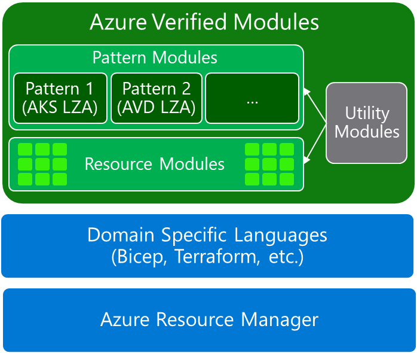

# Azure Verified Modules

---

**Principal author**: [Christos Galanopoulos](/users/christosgalanopoulos/)

---

In today's fast-paced cloud landscape, consistency, reliability, and adherence to best practices are crucial. Azure Verified Modules (AVM) address these needs by providing pre-defined, reusable Infrastructure as Code (IaC) modules developed and maintained by Microsoft for both Bicep and Terraform. They streamline Azure resource deployment, simplifying infrastructure management while ensuring compliance with Microsoft's well-architected framework (WAF). Whether for a small-scale application or a complex architecture, AVM modules provide a reliable foundation for Azure deployments, supported by Microsoft's robust assistance and updates.

---

## Definition

Azure Verified Modules (AVM) offer a consistent approach to deploying and managing Azure resources, developed and supported by Microsoft to meet best practices and compliance requirements. These pre-defined, reusable modules for Infrastructure as Code (IaC) facilitate Azure resource deployment and management, available for both Bicep and Terraform. AVM ensures consistency and adherence to Microsoft's well-architected framework (WAF), making cloud infrastructure management more efficient and reliable.

## Development and Quality Standards

Each AVM module undergoes a meticulous development process to ensure high quality and compliance with best practices:

- **Design and Specification**: Detailed design phases ensure each module meets Azure's architectural and security standards.
- **Coding and Implementation**: Modules are implemented using IaC languages like Bicep and Terraform, following strict coding standards.
- **Automated Testing**: Comprehensive tests, including unit and integration tests, ensure module functionality and reliability.
- **Documentation Generation**: Automatically generated documentation provides clear instructions for users.
- **Review and Approval**: Rigorous reviews by Azure engineers ensure modules meet quality and security standards.

AVM modules are organized in a well-structured repository with clear directories for different resource types and services. Each module is versioned for easy updates and backward compatibility. Regular updates incorporate new features, improvements, and security patches. Published AVM modules are available in public repositories, such as the Azure Verified Modules GitHub repository, and are integrated with tools like the Azure Developer CLI (azd) and the Bicep Registry.

## Benefits

- **Standardization and Consistency**: AVM modules follow a standardized structure and best practices, ensuring consistency across deployments.
- **Support and Longevity**: Officially supported by Microsoft, AVM modules are regularly updated to align with the latest Azure services and features.
- **Language-Agnostic**: Available for Bicep and Terraform, AVM caters to a wide range of IaC preferences and tools.
- **Compliance and Best Practices**: AVM modules are aligned with high-priority recommendations from frameworks like WAF and security benchmarks, ensuring robust and secure deployments.
- **Automated Documentation and Testing**: With built-in support for automated documentation generation and comprehensive testing, AVM modules are easy to use and reliable.

## Module Classifications

AVM defines module classifications that can be created, published, and consumed. Understanding these classifications helps you select the right modules for your infrastructure needs.

### Resource Modules

Resource Modules deploy a primary Azure resource with Well-Architected Framework (WAF) high-priority best practices configured by default. These include optimizations like availability zones, proper firewall settings, enforced Entra ID authentication, and other shared interfaces such as RBAC and Private Endpoints where supported.

These modules may include related resources essential to the primary resource's functionality. For example, a VM module would typically include disks and NICs, as users would expect these components to be part of a complete VM deployment experience. However, Resource Modules explicitly do not deploy external dependencies (like the virtual network that a VM requires).

Resource Modules are ideal for those who want to build custom architectures with individual components that adhere to WAF best practices, or for those creating pattern modules.

### Pattern Modules

Pattern Modules deploy multiple Azure resources together, typically leveraging existing Resource Modules. They can vary in size and complexity but are designed to accelerate the deployment of common architectures or tasks.

Good candidates for Pattern Modules are architectures documented in the Azure Architecture Center or other official Microsoft documentation. While Pattern Modules can include other Pattern Modules, they must not reference non-AVM modules to maintain quality and consistency standards.

These modules are perfect for teams looking to quickly deploy established architectural patterns while maintaining WAF best practices throughout their infrastructure.

### Utility Modules (Draft)

A newer classification currently in draft status, Utility Modules implement functions or routines that can be flexibly reused across Resource or Pattern Modules. For example, a function that retrieves the endpoint of an API or portal for a given environment.

Utility Modules must not deploy any Azure resources except deployment scripts and are designed for module authors who want to leverage commonly used functions without reimplementing them locally.



## How to Use Azure Verified Modules

Using Azure Verified Modules involves selecting the appropriate module, integrating it into your IaC scripts, and deploying it. Below, we detail the steps along with examples in both Terraform and Bicep.

### Steps to Use AVM

1. **Select a Module**: Browse the AVM repository to find the module that fits your needs. Each module is categorized and comes with detailed documentation.
2. **Integrate with Your IaC**: Download the module and integrate it into your existing Bicep or Terraform scripts. Follow the provided instructions for seamless integration.
3. **Deploy the Module**: Use your integrated IaC scripts to deploy the selected AVM module and manage your Azure resources efficiently.

### Example Usage with Terraform

Here's an example of using an AVM module that deploys a production standard AKS cluster along with supporting a virtual network and Azure container registry:

```terraform
module "avm-ptn-aks-production" {
  source  = "Azure/avm-ptn-aks-production/azurerm"
  version = "0.3.0"
  
  kubernetes_version          = "1.30"
  
  name                        = module.naming.kubernetes_cluster.name_unique
  resource_group_name         = azurerm_resource_group.this.name
  location                    = azurerm_resource_group.this.location
  
  private_dns_zone_id         = azurerm_private_dns_zone.mydomain.id
  private_dns_zone_id_enabled = true
  
  rbac_aad_tenant_id          = data.azurerm_client_config.current.tenant_id
  enable_telemetry            = true
  
  network_policy              = "calico"
  network = {
    name                = module.avm_res_network_virtualnetwork.name
    resource_group_name = azurerm_resource_group.this.name
    node_subnet_id      = module.avm_res_network_virtualnetwork.subnets["subnet"].resource_id
    pod_cidr            = "192.168.0.0/16"
  }
  
  acr = {
    name                          = module.naming.container_registry.name_unique
    subnet_resource_id            = module.avm_res_network_virtualnetwork.subnets["private_link_subnet"].resource_id
    private_dns_zone_resource_ids = [azurerm_private_dns_zone.this.id]
  }
}
```

### Example Usage with Bicep

Here's an example of using an AVM module that deploys a resource role assignment:

```bicep
module resourceRoleAssignment 'br/public:avm/ptn/authorization/resource-role-assignment:<version>' = {
  name: 'resourceRoleAssignmentDeployment'
  params: {
    // Required parameters
    principalId: '<principalId>'
    resourceId: '<resourceId>'
    roleDefinitionId: '2a2b9908-6ea1-4ae2-8e65-a410df84e7d1'

    // Optional parameters
    description: 'Assign Storage Blob Data Reader role to the managed identity on the storage account.'
    principalType: 'ServicePrincipal'
  }
}
```

## Summary

Azure Verified Modules provide a robust, standardized approach to deploying Azure resources. By leveraging these modules, organizations can ensure consistency, reliability, and compliance across their cloud infrastructure. The detailed development process and rigorous quality standards behind AVM modules guarantee that they meet the highest levels of performance and security, making them an invaluable tool for any Azure deployment strategy.

## Resources

- [**Azure Verified Modules**](https://azure.github.io/Azure-Verified-Modules/)
- [**Azure Verified Modules GitHub Repository**](https://github.com/Azure/Azure-Verified-Modules)
- [**Bicep Public Module Registry**](https://github.com/Azure/bicep-registry-modules)
