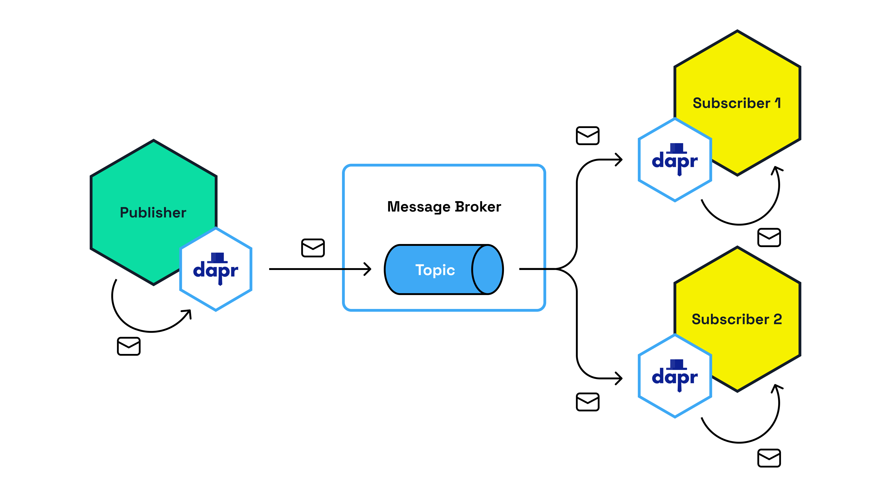

# Quickstart: Speed up the inner development loop with Dapr multi-app run

---

**Principal author**: [Marc Duiker](/users/marcduiker/)

---

Developing and local testing of microservices is challenging, especially when you want to run multiple services on your local dev environment simultaneously. You need to make sure all services are configured correctly (no conflicting ports) and then start them all individually. The more services you build, the more complex this becomes.

This quickstart describes how to use the Dapr CLI to run multiple Dapr services at once. This is a great way to speed up the inner development loop.

## Microservices with Dapr

[Dapr](https://dapr.io) is a portable, event-driven runtime that enables developers to efficiently build resilient, microservice-based applications that runs on the cloud and edge. Developers like to use Dapr since it offers ready to use building blocks for workflow, state management, publish/subscribe, configuration, secrets management, and more. These building block functionalities are exposed through a set of HTTP and gRPC APIs, so any language that supports these protocols can use Dapr.


The [multi-app-run](https://github.com/diagrid-labs/multi-app-run) GitHub repository contains a demo that uses the Dapr publish/subscribe building block to communicate between services. The demo consists of three services written in Nodejs:

- **publisher**: Publishes a message to the `orders` every 1 seconds and prints the message to the console.
- **subscriber1**: Subscribes to the `orders` topic and prints the message to the console.
- **subscriber2**: subscribes to the `orders` topic and prints the message to the console.



> [!NOTE]
> The message broker in this demo is Redis that is running locally in a container. This container is installed automatically when installing the Dapr CLI.

## Prerequisites

In order to run the demo, ensure you use a supported OS and install the required tools:

1. Supported OS: Linux or macOS (Windows is not yet supported)
2. [Nodejs](https://nodejs.org/en/download)
3. [Docker Desktop](https://www.docker.com/products/docker-desktop/)
4. [Dapr CLI](https://docs.dapr.io/getting-started/install-dapr-cli/)

## Running the demo

1. Clone the [multi-app-run](https://github.com/diagrid-labs/multi-app-run) repo locally.
2. Open the `multi-app-run` folder in a new terminal, and run this command to install the Node modules for the three apps:

    ```bash
    npm run install-all
    ```

3. While still in the root of the repository, run this command to start the Dapr runtime and the three apps using the preconfigured multi-app run template file:

    ```bash
    dapr run -f .
    ```

    The above command will read the [dapr.yaml](https://github.com/diagrid-labs/multi-app-run/blob/main/dapr.yaml) file that contains the multi-app run configuration. The file content is explained in the *How it works* section below.

    The output of the `dapr run -f .` command should be similar to this:

    ```bash
    ⚠  This is a preview feature and subject to change in future releases.
    ℹ️  Validating config and starting app "subscriber1"
    == APP - subscriber1 == 
    == APP - subscriber1 == > subscriber1@1.0.0 start
    == APP - subscriber1 == > node index.js
    == APP - subscriber1 == 
    == APP - subscriber1 == 2023-08-20T13:46:06.145Z INFO [HTTPServer, HTTPServerImpl] [Topic = orders] Registered Subscription with routes: default
    == APP - subscriber1 == 2023-08-20T13:46:06.146Z INFO [HTTPServer, HTTPServer] Listening on 5101
    == APP - subscriber1 == 2023-08-20T13:46:06.146Z INFO [HTTPServer, HTTPServer] Registering 1 PubSub Subscriptions
    == APP - subscriber1 == 2023-08-20T13:46:06.157Z INFO [HTTPClient, HTTPClient] Sidecar Started
    == APP - subscriber1 == 2023-08-20T13:46:06.174Z INFO [HTTPServer, HTTPServer] Registered 1 PubSub Subscriptions
    ℹ️  Started Dapr with app id "subscriber1". HTTP Port: 54179. gRPC Port: 54180
    ℹ️  Writing log files to directory : /Users/marcduiker/dev/diagrid-labs/multi-app-run/src/subscriber1/.dapr/logs
    ℹ️  Validating config and starting app "subscriber2"
    == APP - subscriber2 == 
    == APP - subscriber2 == > subscriber2@1.0.0 start
    == APP - subscriber2 == > node index.js
    == APP - subscriber2 == 
    == APP - subscriber2 == 2023-08-20T13:46:07.165Z INFO [HTTPServer, HTTPServerImpl] [Topic = orders] Registered Subscription with routes: default
    == APP - subscriber2 == 2023-08-20T13:46:07.167Z INFO [HTTPServer, HTTPServer] Listening on 5102
    == APP - subscriber2 == 2023-08-20T13:46:07.168Z INFO [HTTPServer, HTTPServer] Registering 1 PubSub Subscriptions
    == APP - subscriber2 == 2023-08-20T13:46:07.182Z INFO [HTTPClient, HTTPClient] Sidecar Started
    == APP - subscriber2 == 2023-08-20T13:46:07.197Z INFO [HTTPServer, HTTPServer] Registered 1 PubSub Subscriptions
    ℹ️  Started Dapr with app id "subscriber2". HTTP Port: 54211. gRPC Port: 54212
    ℹ️  Writing log files to directory : /Users/marcduiker/dev/diagrid-labs/multi-app-run/src/subscriber2/.dapr/logs
    ℹ️  Validating config and starting app "publisher"
    ℹ️  Started Dapr with app id "publisher". HTTP Port: 54245. gRPC Port: 54246
    ℹ️  Writing log files to directory : /Users/marcduiker/dev/diagrid-labs/multi-app-run/src/publisher/.dapr/logs
    == APP - publisher == 
    == APP - publisher == > publisher@1.0.0 start
    == APP - publisher == > node index.js
    == APP - publisher == 
    == APP - publisher == 2023-08-20T13:46:09.263Z INFO [HTTPClient, HTTPClient] Sidecar Started
    == APP - publisher == Published: {"orderId":1}
    == APP - subscriber2 == Subscriber 2 received: {"orderId":1}
    == APP - subscriber1 == Subscriber 1 received: {"orderId":1}
    == APP - publisher == Published: {"orderId":2}
    == APP - subscriber2 == Subscriber 2 received: {"orderId":2}
    == APP - subscriber1 == Subscriber 1 received: {"orderId":2}
    == APP - subscriber2 == Subscriber 2 received: {"orderId":3}
    == APP - subscriber1 == Subscriber 1 received: {"orderId":3}
    == APP - publisher == Published: {"orderId":3}
    == APP - publisher == Published: {"orderId":4}
    == APP - subscriber2 == Subscriber 2 received: {"orderId":4}
    == APP - subscriber1 == Subscriber 1 received: {"orderId":4}
    == APP - subscriber1 == Subscriber 1 received: {"orderId":5}
    == APP - subscriber2 == Subscriber 2 received: {"orderId":5}
    == APP - publisher == Published: {"orderId":5}
    == APP - publisher == Published: {"orderId":6}
    == APP - subscriber2 == Subscriber 2 received: {"orderId":6}
    == APP - subscriber1 == Subscriber 1 received: {"orderId":6}
    == APP - publisher == Published: {"orderId":7}
    == APP - subscriber1 == Subscriber 1 received: {"orderId":7}
    == APP - subscriber2 == Subscriber 2 received: {"orderId":7}
    == APP - publisher == Published: {"orderId":8}
    == APP - subscriber1 == Subscriber 1 received: {"orderId":8}
    == APP - subscriber2 == Subscriber 2 received: {"orderId":8}
    == APP - publisher == Published: {"orderId":9}
    == APP - subscriber1 == Subscriber 1 received: {"orderId":9}
    == APP - subscriber2 == Subscriber 2 received: {"orderId":9}
    == APP - publisher == Published: {"orderId":10}
    == APP - subscriber1 == Subscriber 1 received: {"orderId":10}
    == APP - subscriber2 == Subscriber 2 received: {"orderId":10}
    Exited App successfully
    ```

Congratulations! You have now successfully run three Dapr services with one Dapr CLI command.

## How it works

Now let's have a look how multi-app run is configured in the `dapr.yaml` multi-app run template file:

```yaml
version: 1
common:
  resourcesPath: ./resources/
apps:
  - appID: subscriber1
    appDirPath: ./src/subscriber1/
    appPort: 5101
    appProtocol: http
    command: ["npm", "start"]
    appLogDestination: fileAndConsole
    daprdLogDestination: file
  - appID: subscriber2
    appDirPath: ./src/subscriber2/
    appPort: 5102
    appProtocol: http
    command: ["npm", "start"]
    appLogDestination: fileAndConsole
    daprdLogDestination: file
  - appID: publisher
    appDirPath: ./src/publisher/
    appProtocol: http
    command: ["npm", "start"]
    appLogDestination: fileAndConsole
    daprdLogDestination: file
```

### Common section

The common section is an optional part of the file where variables can be defined that are shared across all Dapr applications that are part of the apps section.

In this case, all Dapr apps use the same pubsub component that is defined in the `resources/pubsub.yaml` file.

Environment variables can also be placed in this common section as follows:

```yaml
common:
    env:  # any environment variable shared across apps
        DEBUG: true
```

### Apps section

The apps section is a list of Dapr applications that are part of the multi-app run. 

> [!NOTE]
> Note that the order of the Dapr applications in this section determines the sequence in which they are started.

The following properties have been used for the apps in this demo:

- `appID`: The ID of the Dapr application. This is used to identify the application in the Dapr dashboard.
- `appDirPath`: The path to the directory where the application is located.
- `appPort`: The port on which the application is listening.
- `appProtocol`: The protocol that the application is using. This can be `http` or `grpc`.
- `command`: The command that is used to start the application.
- `appLogDestination`: The destination of the application logs. This can be `file`, `console` or `fileAndConsole`.
- `daprdLogDestination`: The destination of the Dapr logs. This can be `file`, `console` or `fileAndConsole`.

The full schema of the multi-app run template file can be found in the [Dapr documentation](https://docs.dapr.io/developing-applications/local-development/multi-app-dapr-run/multi-app-template/#template-file-structure).

### Running Dapr with multi-app run

To execute Dapr with multi-app run, specify the path to the multi-app run template file with the `-f` flag:

```bash
dapr run -f <dir_path>
```

> [!NOTE]
> If the multi-app run template file is named `dapr.yaml` and is located in the current directory, the command can be simplified to `dapr run -f .` .

## Next steps

For more information on multi-app run, see the [Dapr documentation](https://docs.dapr.io/developing-applications/local-development/multi-app-dapr-run/).

Do you have any questions about Dapr? Join the the [Dapr discord](https://bit.ly/dapr-discord) and connect with thousands of other developers.
