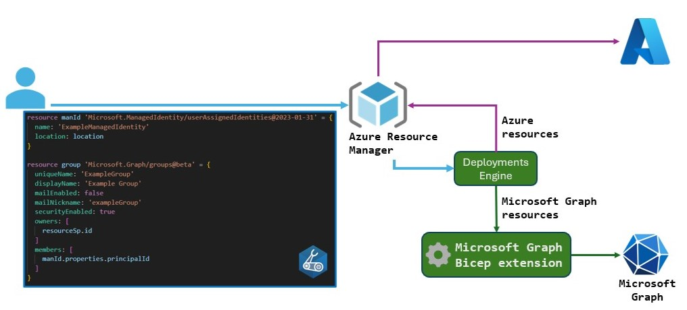
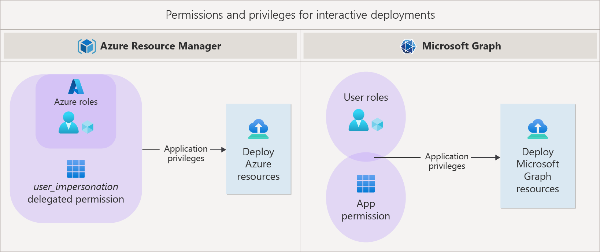
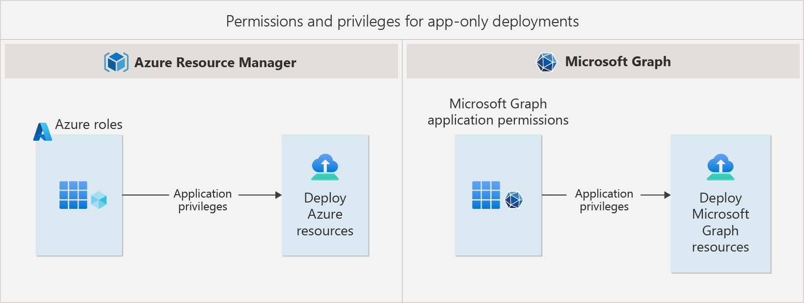

# Microsoft Graph Bicep Extension

---

**Principal author**: [Christos Galanopoulos](/users/christosgalanopoulos/)

---

The Microsoft Graph extension for Bicep enables Azure users to manage Microsoft Graph and Azure Active Directory (Entra ID) resources using infrastructure as code (IaC). Traditionally, managing Entra ID resources required manual configuration or scripting. However, with the Bicep extension, users can now define resources such as groups, applications, and service principals directly within a Bicep template.

This guide provides a comprehensive walkthrough of implementing the Microsoft Graph Bicep extension, from basic setup to advanced usage patterns, with practical examples you can adapt to your environments.

---

## Architecture

The Microsoft Graph Bicep extension seamlessly integrates Microsoft Graph resource management into the familiar Bicep templating system. This integration enables you to manage Azure and Entra ID resources using consistent syntax and deployment patterns.
This extension allows Bicep templates to define tenant resources beyond the traditional Azure Resource Manager scope. Here are the key capabilities of the extension:

- **Namespace**: `Microsoft.Graph` allows for the direct definition of resources in Bicep files, expanding the reach of Bicep templates to include Microsoft Graph resources.
- **Resource Types**: These include `Microsoft.Graph/groups`, `Microsoft.Graph/applications`, and various other resource types specific to Microsoft Graph.
- **Role-Based Permissions**: The extension supports configuring Azure role assignments for Microsoft Graph resources, which enhances secure access and governance.



> [!NOTE]
> For a complete list of supported resource types, refer to the [Microsoft Graph template reference](https://learn.microsoft.com/graph/templates/reference/overview).

## Key Benefits of the Microsoft Graph Bicep Extension

Utilizing the Microsoft Graph Bicep extension provides several advantages:

1. **Enhanced Authoring Experience**: The Bicep extension in Visual Studio Code offers rich type safety, IntelliSense, and syntax validation, catching potential errors before deployment and speeding up development.
2. **Consistent Deployment**: Bicep templates ensure repeatable deployments across environments, allowing for consistent configurations of Microsoft Graph resources and eliminating environment-specific variations.
3. **Integrated Orchestration**: Bicep automatically manages interdependent resources, determining the order of operations and deploying resources in parallel whenever possible, significantly reducing deployment time and complexity.

## Permissions

When deploying Bicep templates that involve both Azure and Microsoft Graph resources, specific permissions are essential for ensuring a smooth deployment. Since Azure and Microsoft Graph utilize different types of permissions and access mechanisms, understanding these differences is crucial for effectively managing and deploying resources.

### Access Scenarios

There are two primary methods for accessing Azure and Microsoft Graph APIs during deployment:

- **Delegated (Interactive) Access**: In this scenario, an application operates on behalf of a signed-in user. This approach is commonly used for hands-on deployments through tools like Azure CLI and PowerShell.
- **App-Only (Non-Interactive) Access**: Here, the application functions independently with its own identity, making it ideal for automated workflows, such as CI/CD pipelines.

### Permission Types

The Microsoft Graph APIs support two types of permissions based on the access scenario: delegated and application permissions.

#### Delegated Permissions

These permissions are utilized in interactive access. They depend on the app's OAuth scopes and the permissions granted to the user.



#### Application Permissions

For app-only access, permissions are assigned directly to the application by an administrator, without the need for a signed-in user.



> [!TIP]
> To maintain secure deployments, it is important to adhere to the principle of least privilege. This principle encourages granting only the necessary permissions required for each application's function, thereby reducing the potential impact in the event of an application compromise. By carefully setting up these permissions, you can ensure secure and efficient deployments of Azure and Microsoft Graph resources through Bicep.

## Unique Resource Names

Azure and Microsoft Graph APIs utilize different methods for creating resources, which can complicate deployments within Bicep templates:

- **Azure Resources**: These resources are created using the *HTTP PUT* method with a client-defined unique key (name), allowing for idempotent operations. This means that the same deployment can be repeated with consistent results.
- **Microsoft Graph Resources**: In contrast, these resources are created using the *HTTP POST* method, which is not idempotent and generates a unique ID (id) rather than relying on a client-defined key.

This distinction can pose challenges when deploying Microsoft Graph resources in Bicep templates. Specifically, it can hinder the ability to ensure repeatable deployments, as POST methods do not exhibit the idempotent behavior characteristic of PUT methods.

To address these challenges, client-provided keys can be utilized to achieve idempotency with Microsoft Graph resources. These keys enable an **"upsert"** mechanism (update & insert), which allows resources to be created if they do not exist or updated if they do. Examples of client-provided keys include:

- **Applications**: `uniqueName`
- **Groups**: `uniqueName`
- **Service Principals**: `appId`
- **Federated Identity Credentials**: `name`

While this client-provided key property is often an alternate key, it may sometimes serve as the primary key. Resources created without client-provided keys may require a one-time backfill of keys to support declarative re-deployments. After defining these keys, resources can be included in Bicep files to ensure consistent and repeatable deployments.

## Common Use Cases

The Microsoft Graph Bicep extension enables several practical automation scenarios that streamline Entra ID resource management:

**Identity Management:**

- Automated provisioning of security groups for new projects or teams
- Consistent creation and configuration of service principals for applications
- Standardized management of application registrations across environments

**Access Control:**

- Implementation of role-based access control (RBAC) patterns at scale
- Automated assignment and management of permissions across multiple tenants
- Standardized group membership management for different project phases

**Application Lifecycle:**

- Automated creation and configuration of application registrations for development, staging, and production environments
- Management of application credentials and certificates with proper rotation policies
- Consistent federation setup for applications across different identity providers

**Compliance and Governance:**

- Implementation of standardized naming conventions across Entra ID resources
- Automated cleanup of stale or unused identities and permissions
- Consistent application of security policies across multiple applications

These use cases demonstrate how the Microsoft Graph Bicep extension can transform manual, error-prone processes into automated, repeatable operations. By implementing these patterns through infrastructure as code, organizations can ensure consistency, reduce administrative overhead, and maintain better security controls.

## Examples

### Preliminary Setup

To use the Microsoft Graph Bicep extension, you need to enable the experimental feature in your Bicep configuration file. It is also advisable to use [dynamic types](https://learn.microsoft.com/graph/templates/how-to-migrate-to-dynamic-types) rather than built-in types. Below is an example of the configuration file:

```json
{  
  "experimentalFeaturesEnabled": {  
    "extensibility": true  
  },
  "extensions": {  
    "graphV1": "br:mcr.microsoft.com/bicep/extensions/microsoftgraph/v1.0:<v1.0-version>",
    "graphBeta": "br:mcr.microsoft.com/bicep/extensions/microsoftgraph/beta:<beta-version>"  
  }  
}
```

```bicep
extension graphV1
extension graphBeta

// using Microsoft Graph v1.0
resource group 'Microsoft.Graph/groups@v1.0' existing = {
  uniqueName: groupName
}

// using Microsoft Graph beta
resource app 'Microsoft.Graph/applications@beta' existing = {
  uniqueName: appName
}
```

The examples above use the following Bicep configuration:

```json
{  
  "experimentalFeaturesEnabled": {  
    "extensibility": true  
  },
  "extensions": {
    "microsoftGraphV1": "br:mcr.microsoft.com/bicep/extensions/microsoftgraph/v1.0:0.1.9-preview"
  }
}
```

### Creating a Security Group

Here's an example of creating a security group and assigning a role-based permission using the Microsoft Graph Bicep extension:

```bicep
extension microsoftGraphV1

@sys.description('Specifies the role definition ID used in the role assignment.')
param roleDefinitionID string

@sys.description('The unique identifier that can be assigned to a group and used as an alternate key.')
param uniqueName string

@sys.description('The display name for the group.')
param displayName string

@sys.description('Specifies whether the group is mail-enabled.')
param mailEnabled bool

@sys.description('The mail alias for the group, unique for Microsoft 365 groups in the organization.')
param mailNickname string

@sys.description('Specifies whether the group is a security group.')
param securityEnabled bool

resource group 'Microsoft.Graph/groups@v1.0' = {
  uniqueName: uniqueName
  displayName: displayName
  mailEnabled: mailEnabled
  mailNickname: mailNickname
  securityEnabled: securityEnabled
}

var roleAssignmentName = guid(uniqueName, roleDefinitionID, resourceGroup().id)
resource roleAssignment 'Microsoft.Authorization/roleAssignments@2022-04-01' = {
  name: roleAssignmentName
  scope: resourceGroup()
  properties: {
    principalId: group.id
    roleDefinitionId: resourceId('Microsoft.Authorization/roleDefinitions', roleDefinitionID)
  }
}
```

In this example, the Bicep template creates a security group with specified parameters and assigns role-based permissions to the group. The `uniqueName` parameter acts as the client-provided key for the group, ensuring that operations are idempotent.

One potential issue that may arise is that the instantiation of the principal or identity might not occur immediately. As a result, chained operations could fail in this scenario.

```json
{"status":"Failed","error":{"code":"DeploymentFailed","target":"/subscriptions/xxxxxxxx-xxxx-xxxx-xxxx-xxxxxxxxxxxx/resourceGroups/rg-test/providers/Microsoft.Resources/deployments/deployment1","message":"At least one resource deployment operation failed. Please list deployment operations for details. Please see <https://aka.ms/arm-deployment-operations> for usage details.","details":[{"code":"PrincipalNotFound","message":"Principal xxxxxxxxxxxxxxxxxxxxxxxxxxxxxxxx does not exist in the directory xxxxxxxx-xxxx-xxxx-xxxx-xxxxxxxxxxxx. Check that you have the correct principal ID. If you are creating this principal and then immediately assigning a role, this error might be related to a replication delay. In this case, set the role assignment principalType property to a value, such as ServicePrincipal, User, or Group.  See https://aka.ms/docs-principaltype"}]}}
```

### Creating an Application with a Service Principal

Here's an example of creating an application and its associated service principal using the Microsoft Graph Bicep extension:

```bicep
extension microsoftGraphV1

@sys.description('The unique name of the application.')
param uniqueName string

@sys.description('The display name of the application.')
param displayName string = ''

@sys.description('The description of the application.')
param description string

resource app 'Microsoft.Graph/applications@v1.0' = {
  uniqueName: uniqueName
  displayName: displayName
  description: description
}

resource sp 'Microsoft.Graph/servicePrincipals@v1.0' = {
  appId: app.appId
}
```

In this example, the Bicep template creates an application and its associated service principal using the specified parameters. The `uniqueName` parameter serves as the client-provided key for the application and the `appId` for the service principal, ensuring idempotent operations.

### Common Issues and Solutions

1. **Replication Delays**: When creating principals and immediately assigning roles, you may encounter replication delay errors. Add retry logic or implement appropriate wait conditions in your deployment scripts.

2. **Permission Scoping**: Ensure your deployment identity has appropriate permissions in both Azure and Microsoft Graph scopes. Missing permissions are a common cause of deployment failures.

3. **Idempotency Challenges**: When working with Microsoft Graph resources, pay special attention to client-provided keys to ensure reliable, repeatable deployments.

> [!NOTE]
> More known issues and solutions can be found in the [Microsoft Graph Bicep](https://learn.microsoft.com/graph/templates/known-issues-graph-bicep) documentation.

## Summary

The Microsoft Graph Bicep extension represents a significant advancement in Azure infrastructure management, bridging the gap between Azure Resource Manager and Microsoft Graph resources. By enabling declarative management of Entra ID resources, it streamlines operations and reduces manual configuration errors.

Key takeaways:

- Unified IaC approach for both Azure and Entra ID resources
- Strong security controls through proper permission management
- Improved deployment consistency and reliability
- Reduced operational overhead through automation

To get started, ensure your Bicep environment is properly configured with the extension enabled, and begin with simple resource definitions before moving to more complex scenarios.

## Resources

- [**Microsoft Graph Bicep Extension**](https://learn.microsoft.com/graph/templates/overview-bicep-templates-for-graph)
- [**Quickstart Templates**](https://github.com/microsoftgraph/msgraph-bicep-types/tree/main/quickstart-templates)
