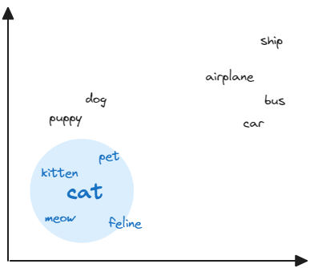

# Store, index and query Azure AI Vision embeddings in Azure Cosmos DB for PostgreSQL

---

**Principal author**: [Foteini Savvidou](https://learn.microsoft.com/users/foteinisavvidou-7240/)

---

Searching over text documents, images, and audio files and finding similar ones is one of the most common tasks we do in our daily lives. Conventional search systems rely on exact matches on properties like keywords, tags, or other metadata, lexical similarity, or the frequency of word occurrences. Recently, vector similarity search has transformed the search process. It leverages machine learning to capture the meaning of data, allowing you to find similar items based on their content. The key idea behind vector search involves converting unstructured data, such as text, images, videos, and audio, into high-dimensional vectors (also known as embeddings) and applying nearest neighbor algorithms to find similar data.

In this tutorial, you learn how to:

* Generate embeddings for a collection of images using the Azure AI Vision multi-modal embeddings API.
* Store embeddings in Azure Cosmos DB for PostgreSQL using the pgvector extension.
* Create indexes for approximate nearest neighbor search.
* Search for images that are most similar to a reference image or a text prompt.

## Prerequisites

To proceed with this tutorial, ensure that you have the following prerequisites installed and configured:

* An Azure subscription - [Create an Azure free account.](https://azure.microsoft.com/free/?WT.mc_id=AI-MVP-5004971)
* An Azure AI Vision resource or a multi-service resource for Azure AI services - [Create an Azure AI Services multi-service resource in the Azure portal.](https://portal.azure.com/#create/Microsoft.CognitiveServicesAllInOne)
* An Azure Cosmos DB for PostgreSQL cluster - [Create an Azure Cosmos DB for PostgreSQL cluster in the Azure portal.](https://portal.azure.com/#view/Microsoft_Azure_DocumentDB/CreatePostgreSQL.ReactView)
* Python 3.10 and Visual Studio Code.
* A collection of images - I'll be using a subset of the images from the [SemArt Dataset](https://researchdata.aston.ac.uk/id/eprint/380/) for this tutorial.

> [!NOTE]
> The multi-modal embeddings APIs are available in the following regions: East US, France Central, Korea Central, North Europe, Southeast Asia, West Europe, West US.

The complete functional project is available in the [Vector search with Azure Cosmos DB for PostgreSQL GitHub repository](https://github.com/sfoteini/vector-search-azure-cosmos-db-postgresql).

## Concepts

### Vector embeddings

Comparing unstructured data is challenging, in contrast to numerical and structured data, which can be easily compared by performing mathematical operations. What if we could convert unstructured data, such as text and images, into a numerical representation? We could then calculate their similarity using standard mathematical methods.

Vector embeddings are a technique for converting unstructured data into numerical representations which capture the information contained in the original data. These vectors are created using machine learning algorithms that capture the meaning of the data, recognize patterns, and identify similarities between the data.

### Vector similarity

The numerical distance between two embeddings, or equivalently, their proximity in the vector space, represents their similarity. Vector similarity is commonly calculated using distance metrics such as Euclidean distance, inner product, or cosine distance. The following image illustrates word embeddings in a 2-dimensional vector space. Words that are semantically similar are located close together, while dissimilar words are placed farther apart.



Vector similarity can be used in various industry applications, including recommender systems, fraud detection, text classification, and image recognition. For example, systems can use vector similarities between products to identify similar products and create recommendations based on a user's preferences.

## 1 - Create vector embeddings with Azure AI Vision

Azure AI Vision provides two APIs for vectorizing images and text: the Vectorize Image API and the Vectorize Text API. This vectorization converts images and text into coordinates in a 1024-dimensional vector space, enabling users to search a collection of images using text and/or images without the need for metadata, such as tags, keywords, or captions.

Computing the vector embedding of an image involves sending a POST request to the Azure AI Vision Vectorize Image API. The binary image data is included in the request body, and the response consists of a JSON object containing the vector embedding of the image. In Python, this can be achieved by utilizing the `requests` library to send a POST request.

```python
def get_image_embedding(image_filepath, endpoint, key, version):
    with open(image_filepath, "rb") as img:
        data = img.read()

    # Vectorize Image API
    vision_api = endpoint + "retrieval:vectorizeImage" + version

    headers = {
        "Content-type": "application/octet-stream",
        "Ocp-Apim-Subscription-Key": key,
    }

    try:
        r = requests.post(vision_api, data=data, headers=headers)
        if r.status_code == 200:
            image_vector = r.json()["vector"]
            return image_vector
        else:
            print(
                f"An error occurred while processing {image_filepath}. "
                f"Error code: {r.status_code}."
            )
    except Exception as e:
        print(f"An error occurred while processing {image_filepath}: {e}")

    return None
```

> [!TIP]
> To vectorize a remote image, you would include the publicly available URL of the image in the request body.

The `get_image_embedding` function can be used for calculating the embeddings of the images in our collection. Depending on the dataset's size, we can utilize multiple threads to compute the embeddings of all the image efficiently. The full script is available in the [project's GitHub repository](https://github.com/sfoteini/vector-search-azure-cosmos-db-postgresql/blob/main/data_processing/generate_embeddings.py). Executing this script will generate a CSV file containing 11,206 records.

> [!IMPORTANT]
> It is recommended to use the standard tier for Azure AI Vision because the free tier allows only 20 transactions per minute.

## 2 - Activate the pgvector extension

The [pgvector extension](https://github.com/pgvector/pgvector) adds vector similarity search capabilities to a PostgreSQL database. To install the extension, run the `CREATE_EXTENSION` command from the psql command prompt after connecting to your database:

```postgresql
SELECT CREATE_EXTENSION('vector');
```

The pgvector extension introduces a data type called `VECTOR` that can be used during the creation of a table to indicate that a column will hold vector embeddings.

## 3 - Store embeddings in an Azure Cosmos DB for PostgreSQL table

We'll create a table named `paintings`, which will include an embedding column of type `VECTOR(1024)`, representing a 1024-dimensional vector generated by Azure AI Vision. Metadata for paintings, such as the title, author's name, or description, can also be stored in this table.

```postgresql
CREATE TABLE paintings(
    image_file TEXT PRIMARY KEY,
    vector VECTOR(1024)
    );
```

Once the table is created, we can populate it with the data from the CSV file created in [step 1](#1---create-vector-embeddings-with-azure-ai-vision). This can be accomplished using the PostgreSQL `COPY` command.

```python
import psycopg2
import psycopg2.pool

table_name = "<your-table-name>"
postgres_connection_string = "<your-connection-string>"
dataset_filepath = "<your-dataset-filepath>"

postgresql_pool = psycopg2.pool.SimpleConnectionPool(1, 20, postgres_connection_string)

# Get a connection from the connection pool
conn = postgresql_pool.getconn()
cursor = conn.cursor()

with open(dataset_filepath) as csv_file:
    cursor.copy_expert(
        f"COPY {table_name} FROM STDIN WITH "
        f"(FORMAT csv, DELIMITER '\t', HEADER MATCH);",
        csv_file
    )

conn.commit()
cursor.close()
conn.close()
```

The code for inserting vector embeddings into an Azure Cosmos DB for PostgreSQL table can be found at the [project's GitHub repository](https://github.com/sfoteini/vector-search-azure-cosmos-db-postgresql/blob/main/data_upload/upload_data_to_postgresql.py).

## 4 - Query embeddings using the pgvector extension

To find images similar to a text prompt or a reference image, we use SQL `SELECT` statements and the built-in vector operators like the `<=>` operator, which calculates the cosine distance between two vectors. The following code retrieves 12 paintings that are semantically similar to the search term *"a table with flowers"* by calculating the cosine distance between the query vector and every vector in the table. It then selects the records corresponding to the smallest distance.

```python
text_prompt = "a table with flowers"
query_vector = get_text_embedding(
    text=text_prompt,
    endpoint=vision_endpoint,
    key=vision_key,
    version=vision_api_version,
)
# Vector search
cursor.execute(
    f"SELECT * FROM paintings ORDER BY vector <=> %s LIMIT 12;",
    (str(query_vector),),
)

# Retrieve the results
rows = cursor.fetchall()
```

The `get_text_embedding` function computes the vector embedding of the specified text prompt by sending a POST request to the Azure AI Vision Vectorize Text API.

```python
def get_text_embedding(text, endpoint, key, version):
    # Vectorize Text API
    vision_api = endpoint + "retrieval:vectorizeText" + version

    headers = {
        "Content-type": "application/json",
        "Ocp-Apim-Subscription-Key": key
    }

    try:
        r = requests.post(vision_api, json={"text": text}, headers=headers)
        if r.status_code == 200:
            text_vector = r.json()["vector"]
            return text_vector
        else:
            print(
                f"An error occurred while processing the prompt '{text}'. "
                f"Error code: {r.status_code}."
            )
    except Exception as e:
        print(f"An error occurred while processing the prompt '{text}': {e}")

    return None
```

Using the same process, we can retrieve paintings that are most similar to a reference image.

```python
reference_image = "reference_image.jpg"
query_vector = get_image_embedding(
    image=reference_image,
    endpoint=vision_endpoint,
    key=vision_key,
    version=vision_api_version,
)
# Vector search
cursor.execute(
    f"SELECT * FROM paintings ORDER BY vector <=> %s LIMIT 12;",
    (str(query_vector),),
)

# Retrieve the results
rows = cursor.fetchall()
```

The entire functional project is available in the [Vector search with Azure Cosmos DB for PostgreSQL GitHub repository](https://github.com/sfoteini/vector-search-azure-cosmos-db-postgresql/blob/main/vector_search_samples/image_search.ipynb).

## 5 - Create an index for approximate nearest neighbor search

By default, pgvector performs exact nearest neighbor search, calculating the similarity between the query vector and every vector in the table. While this type of search provides perfect recall, it often leads to longer search times. To enhance efficiency for large datasets, we should create indexes to enable approximate nearest neighbor search, which trades off result quality for speed. Pgvector supports two types of approximate indexes:

* Inverted File with Flat Compression (IVFFlat) index
* Hierarchical Navigable Small World (HNSW) index

The IVFFlat algorithm operates by grouping the vectors in the dataset into clusters (also known as *Voronoi regions* or *cells*) and limiting the search scope to the few nearest clusters for each query rather than the entire dataset. The following parameters are used for creating and querying an IVFFlat index.

|Parameter |Description |
|----------|------------|
|`lists`   |It specifies the number of clusters that will be created. Pgvector suggests that an appropriate number of lists is `rows/1000` for datasets with up to 1 million rows and `sqrt(rows)` for larger datasets. It is also advisable to create at least 10 clusters. |
|`probes`  |It defines the number of clusters to consider during search. According to pgvector, the recommended value for `probes` is `sqrt(lists)`. The default value is 1. |

The HNSW index is based on the construction of a multi-layered graph structure, that is optimized for performing approximate nearest neighbor search. In this graph structure, the datapoints are connected to each other by edges, which make it possible to navigate through the graph by following these edges. Compared to the IVFFlat index, the HNSW index generally provides better query performance in terms of the tradeoff between recall and speed, but at the expense of higher build time and more memory usage.

For creating and querying an HNSW index, three parameters should be specified, as presented in the following table:

|Parameter |Description |
|----------|------------|
|`m`               |It specifies the maximum number of connections with neighboring datapoints per point per layer. Its default value is 16. |
|`ef_construction` |It defines the size of the list that holds the nearest neighbor candidates when building the index. The default value is 64. |
|`ef_search`       |It specifies the size of the list that holds the nearest neighbor candidates during query execution. The default value is set to 40. |

To create an index, you use the SQL `CREATE INDEX` statement and specify the distance metric for building the index along with the parameters related to the index type (either HNSW or IVFFlat). For example, the following command creates an IVFFlat index in the `paintings` table using 15 clusters and the cosine distance:

```postgresql
CREATE INDEX ON paintings USING ivfflat (vector vector_cosine_ops) WITH (lists = 15);
```

To retrieve vectors using an approximate index, you use the same SQL `SELECT` statements as in [step 4](#4---query-embeddings-using-the-pgvector-extension). It's important to note that PostgreSQL does not guarantee the use of an index, as it may determine that a sequential scan could be more efficient for a query. To check whether PostgreSQL utilizes an index in a query, you can investigate the query plan by prefixing the `SELECT` statement with the `EXPLAIN ANALYZE` keywords.

```python
cursor.execute(
    f"EXPLAIN ANALYZE SELECT * FROM paintings "
    f"ORDER BY vector <=> %s LIMIT 12;",
    (str(query_vector),),
)
```

Sample code demonstrating image-to-image and text-to-image search scenarios using an [IVFFlat index](https://github.com/sfoteini/vector-search-azure-cosmos-db-postgresql/blob/main/vector_search_samples/image_search_ivfflat_index.ipynb) or an [HNSW index](https://github.com/sfoteini/vector-search-azure-cosmos-db-postgresql/blob/main/vector_search_samples/image_search_hnsw_index.ipynb) can be found in the project's GitHub repository.

## Clean up resources

If you don't plan to use this application, delete the Azure Cosmos DB for PostgreSQL cluster and the Azure AI Vision resource or the resource group from the Azure Portal to avoid incurring unnecessary costs.

## Next steps

Through this how-to guide, you explored the core features of the pgvector extension for vector similarity search. You started by generating embeddings for images using Azure AI Vision, then proceeded to create a table in Azure Cosmos DB for PostgreSQL and populate it with data. Next, you queried the table to retrieve images similar to a search term or a reference image. Additionally, you learned how to create indexes to enable approximate nearest neighbor search and investigate the execution plan.

Here is a list of useful resources to further enhance your skills:

* [Azure AI Vision Multi-modal embeddings – Microsoft Docs](https://learn.microsoft.com/azure/ai-services/computer-vision/concept-image-retrieval?WT.mc_id=AI-MVP-5004971)
* [How to use pgvector on Azure Cosmos DB for PostgreSQL – Microsoft Docs](https://learn.microsoft.com/azure/cosmos-db/postgresql/howto-use-pgvector?WT.mc_id=AI-MVP-5004971)
* [How to optimize performance when using pgvector on Azure Cosmos DB for PostgreSQL – Microsoft Docs](https://learn.microsoft.com/azure/cosmos-db/postgresql/howto-optimize-performance-pgvector?WT.mc_id=AI-MVP-5004971)
