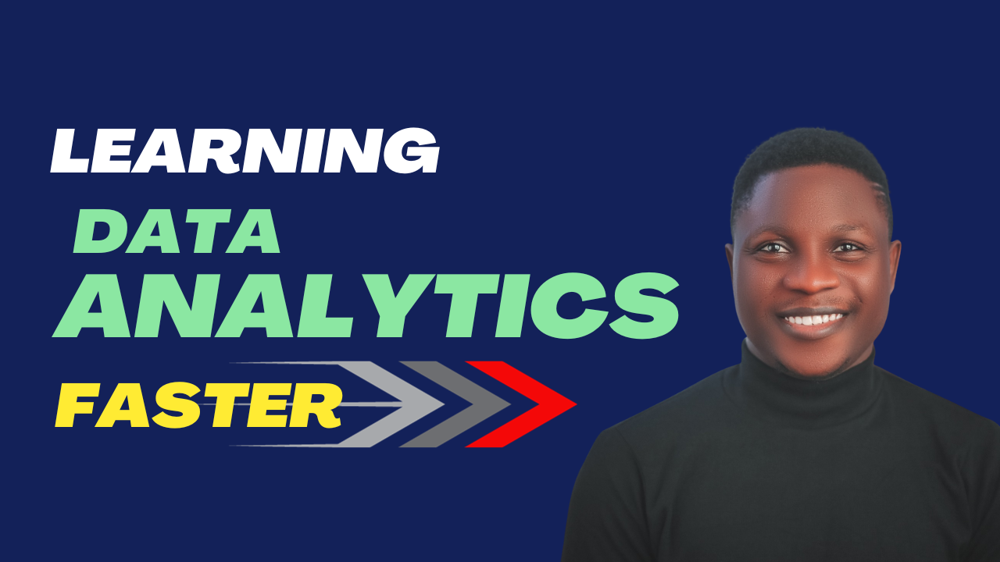

# Data Analysis with Power BI for Absolute Beginners 

---

**Principal author**: [Olanrewaju Oyinbooke](https://learn.microsoft.com/users/theoyinbooke)

---

The journey to learning Data Analysis is as good as starting with the right resources and keeping them basic. In this article, I will help you streamline your learning journey by focusing on what matters in a timely manner.

One of the challenges beginners face in this recent time while learning Data Analysis with Power BI is abundance of information which is opten called Information Overload. There are thousands of resources and learning path out there that make beginners easily get overwhelmed. 

You need to overcome the beginners' inertia. Yes, that's the force that hold you down to beginners content for several months without making significant progress. This article will provide some guides on how to overcome this challenge with resource recommendation.

## Start from here

Before I share the recommended learning content, below are tips to bear in mind if you want to overcome the beginners' inertia:
- Take beginners Courses: It is important to take beginners learning content but don't stay there.
- Start Beginners Project: Few weeks after learning the fundamentals, start beginners' friendly projects. that is a viable way to internalize what you've learnt and translate your knowledge to skills. 
- Seek Community/Mentor Review: Microsoft has a great community of learners. Find local communities to join and mentors to learn from.

## Is this all?
I am sure you are wondering if this is all that is required in your learning journey. There are lots of recommendations for beginners and I would like to list some of them here. I often recommend sometimes to start a Data Analysis journey with Applications like Excel but if you are starting from here, you are on track.

## It is not what you are thinking

Data Analytics is not what you are thinking. It is not about Excel, Power BI, Python, or any other tools out there. Data Analytics is all about "Business Value". Once you understand this and how to meet this need, the journey becomes easier for you.

When you are given a data problem, your focus should be
1. What is the challenge I am trying to address or solve. Are there specifics KPIs or questions to be answered from the work?
2. What Data Do I have? Can the available data deliver on the set deliverables?
3. What will the result look like? will it be more than a report/dashboard
4. Who are the stakeholders?
5. What is the timeline?

Knowing what to focus on in your learning journey will save you years and help you grow faster. This is how you should think and approach Data Analytics projects. It is when you ask these questions that you can meet the stakeholders need thereby delivering value to the organization. 

It is not about the tools, it is about business value.

## Time to learn
I am glad you have come to understand the real thing about Data Analytics, It is never about the tools, it is first, about the business. Now it's time to get started and Learn. I have curated somePower BI beginners friendly learning content on Microsoft Learn. You earn badges and trophies for completing the modules and learning path.

[Click Here to start learning](https://learn.microsoft.com/en-us/collections/60nmc8q70e561d)

## Without this, you are not done
You are not done with your learning until you do this. Remember, I want to help you translate your knowledge of Power BI to Skill and to validate this, you will need to work on a project. finish up the dataset used in the learning modules, build a report, and share it on LinkedIn and X. You are creating the needed visibility for yourself and it counts on your learning journey.
